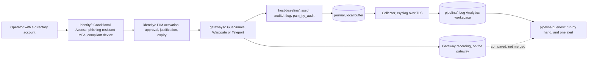

# privileged-access-recording

[](https://github.com/michealzs/privileged-access-recording/actions/workflows/ci.yml)
[](LICENSE)

Recorded, brokered access to servers and clusters, as configuration. Every interactive session goes through a gateway that records it, identity comes from the directory, elevation is time bound and approved, and the host keeps its own audit trail so the gateway's recording is not the only evidence. Three gateways are configured for real in `gateways/` with a decision table between them, the host half is four Ansible roles in `host-baseline/`, the directory half is Terraform in `identity/`, and `pipeline/` is where the host's record goes and what reads it.

The premise is that one recorder is not enough. A recording that lives only on the gateway is not evidence against a gateway administrator, and a recording that lives only on the host is not evidence against somebody with root on that host. So there are two, written by different processes with different trust assumptions, and a set of queries whose job is to compare them.



## Context

This repository is a rebuild of work done in a real environment, written from
scratch for publication. It carries no code, configuration, data or findings
over from it.

The fields below are the detail that was removed. They are placeholders on
purpose, not fields waiting to be filled in: the real values exist and stay
private.

| Field | Value |
| --- | --- |
| Client | `${CLIENT}` |
| Environment | `${ENVIRONMENT}` |
| Engagement | `${ENGAGEMENT}` |

Those three tokens are real environment variables. Copy `context.env.example` to
`context.env`, fill it in, and run `make context` to render a `README.local.md`
that git ignores. They appear nowhere else in this repository. Every other
placeholder here, such as the `example-` names and the all-zero GUID, means the
opposite: a value you supply before the code will run.

## What is in here

| Directory | What it holds |
| --- | --- |
| `gateways/guacamole/` | A four container `docker-compose.yml` with pinned images, OIDC against the directory, graphical and typescript recording, a retention job, and a doc on where recordings land and how to play them back |
| `gateways/warpgate/` | `warpgate.yaml` covering SSH, HTTPS and Kubernetes targets, with a table of which protocols produce a replayable recording and which produce an access log |
| `gateways/teleport/` | A minimal `teleport.yaml` for SSH and Kubernetes with proxy recording, and `sso-and-tiers.md` on which single sign on features are paid tier only |
| `gateways/comparison.md` | The decision table: protocols, recording fidelity, single sign on availability and cost, self hosting effort, and what each one does when it is down |
| `host-baseline/` | Four Ansible roles, `site.yml`, an example inventory, a molecule scenario across two distributions, and `docs/audit-volume.md` |
| `identity/` | Terraform on the `azuread` provider: Conditional Access, PIM eligible assignments with approval and expiry, and `break-glass.md` |
| `pipeline/` | Terraform on the `azurerm` provider for the workspace and the data collection rule, the collector and agent configuration, and `queries/` |
| `docs/` | `architecture.md` with a diagram, `threat-model.md`, `runbook.md` |

## Quick start

Nothing here needs a cloud account or a cluster to validate. The gateways need Docker or a binary, and the host baseline needs a RHEL family host.

```bash
git clone https://github.com/michealzs/privileged-access-recording.git
cd privileged-access-recording

make                    # the target list
make yamllint           # yamllint across the repository
```

To bring up the Guacamole gateway:

```bash
cd gateways/guacamole
cp .env.example .env
$EDITOR .env                          # database password, OIDC endpoints, public URL

mkdir -p initdb
docker run --rm guacamole/guacamole:1.5.5 /opt/guacamole/bin/initdb.sh --postgresql \
  > initdb/01-schema.sql

docker compose config -q
docker compose up -d
```

Then delete the `guacadmin` account the generated schema creates, before anything
else. It ships with a publicly known password and system administrator
permissions, and the database is still an authentication path whatever
`EXTENSION_PRIORITY` is set to. [gateways/guacamole/README.md](gateways/guacamole/README.md)
has the two commands.

To apply the host baseline, dry run first, always:

```bash
cd host-baseline
python3 -m pip install -r requirements.txt
ansible-galaxy collection install -r requirements.yml -p .collections

ansible-playbook -i inventory/example/hosts.yml site.yml --check --diff
ansible-playbook -i inventory/example/hosts.yml site.yml --diff
```

To apply the directory half:

```bash
cd identity
cp terraform.tfvars.example terraform.tfvars
$EDITOR terraform.tfvars              # tenant, groups, approvers, break glass group
terraform init && terraform plan      # read the plan properly, it is a lockout risk
```

## Choosing a gateway

Three are configured, not one, because the choice is decided by constraints rather than by preference and the constraints differ per team. [gateways/comparison.md](gateways/comparison.md) is the table; the four rows that decide it most often:

- **Windows, RDP or a graphical console in scope.** Guacamole. Neither of the others proxies RDP.
- **Directory sign in over OIDC or SAML, with no budget.** Guacamole or Warpgate. Teleport's OIDC and SAML connectors are Enterprise, which [gateways/teleport/sso-and-tiers.md](gateways/teleport/sso-and-tiers.md) states plainly because it decides the question for most small teams.
- **`kubectl exec` has to be recorded as a session.** Teleport. An HTTPS proxy in front of an API server logs the request and does not record the shell.
- **Configuration has to live in git and stay there.** Guacamole or Teleport. Warpgate's admin UI rewrites its own configuration file.

All three drop live sessions when they are down, and none of them lets you grant access while they are down. That is a property of brokered access rather than of any product, and it is why [docs/runbook.md](docs/runbook.md) has a break glass path that does not go through a gateway.

## The host half

Four roles, applied in a fixed order, and the order is part of the design: `sssd`, then `auditd`, then `tlog`, then `pam_tty_audit`. Identity has to resolve before anything can name a group, and the audit trail has to exist before the recording is configured, or there is a window where recording can be reconfigured unobserved.

Two things about it are worth stating on the front page:

- **Recording is limited to the privileged groups**, through `tlog_scope` and `tlog_record_groups`. Recording every unprivileged login is volume nobody reads and a disclosure problem if a recording leaks.
- **Keystroke capture does not record passwords, and that took configuring.** `tlog_log_input` is false, and `pam_tty_audit` runs without `log_passwd` behind two separate variables so an inherited `group_vars` file cannot turn it on quietly. [host-baseline/roles/pam_tty_audit/README.md](host-baseline/roles/pam_tty_audit/README.md) explains what is still captured regardless, which is any secret typed where the terminal echoes.

`auditd` covers what `tlog` structurally cannot: `ssh host command`, `scp`, `sftp` and port forwarding never get a login shell and so never produce a recording. It also watches the recording configuration itself, because somebody turning the recording off is the event the whole design exists to notice.

[host-baseline/docs/audit-volume.md](host-baseline/docs/audit-volume.md) is what to read before setting retention. One rule produces nearly all of the volume, and configuration management produces nearly all of that rule.

## Identity, and why elevation is not in the gateway

None of the three gateways does time bound elevation with an approval step in a free build. `identity/` does it in the directory instead, with PIM eligible membership of the group that grants gateway access: activation needs multifactor, a written justification, an approval from somebody who is not eligible themselves, and it expires by itself.

That approval is only worth something if somebody is named. `require_activation_approval` with an empty `activation_approver_object_ids` does not produce a policy nobody can satisfy: the directory falls back to the group owners and the Privileged Role Administrators, which can include the person activating. A precondition refuses that combination at plan time, and [identity/README.md](identity/README.md) explains what the directory actually does with it.

Conditional Access requires phishing resistant multifactor and a compliant device for the administrative roles, as an authentication strength rather than the older "require multifactor" control, because that older control is satisfied by a push notification and a push notification is phishable.

Both policies deploy in report-only, and both exclude the break glass group. [identity/break-glass.md](identity/break-glass.md) is required reading before applying any of it: forgetting that exclusion locks everyone out, and the exclusion is only safe because of three alerts that are described there.

## Where the evidence goes

`pipeline/` is the second copy. Hosts forward over TLS with a disk assisted queue, a collector receives, the agent ships it into a Log Analytics workspace, and `pipeline/queries/` is what reads it. The four queries the design is built around:

| Query | Answers |
| --- | --- |
| `sessions-by-user-this-week.kql` | Who was recorded, on what, for how long |
| `recording-failed-to-start.kql` | Which logins produced no recording, which is the only way a silent failure becomes visible |
| `sudo-outside-change-windows.kql` | Which elevations happened outside an approved window |
| `activation-then-session.kql` | Which activation a session belongs to, which is what makes time bound elevation auditable rather than decorative |

The rest of `pipeline/queries/` covers the absence cases: a host that stopped reporting, a login that did not come through the gateway, a change to the recording configuration.

## Validation

```bash
make validate        # yamllint, ansible-lint, syntax check, shellcheck, actionlint, terraform, context tokens
make molecule        # the two distribution scenario, needs Docker
make tf-validate     # tfvars-check, then init -backend=false, validate and fmt -check for both roots
make tfvars-check    # every key in a .tfvars.example exists, every required variable is set
make context-check   # the README Context tokens and context.env.example agree, both directions
```

`make validate` is what CI runs, minus the Docker half. The molecule scenario proves that every file is rendered, owned and moded correctly, parses, carries the audit keys the queries select on, and that a second run reports no change. It cannot prove that `auditd` loads the rules or that `tlog` substitutes a shell, because a container has neither a kernel audit socket nor a directory, and that gap is named in the limitations below rather than papered over.

## Variables you will want to change

The ones that decide whether any of this is doing something, in the order they matter:

- `tlog_record_groups` in `host-baseline/inventory/example/group_vars/all.yml`. Who is recorded. Empty or wrong, and the rest is theatre.
- `sssd_allowed_groups`. The access control list. A directory account outside these groups authenticates and is then refused a session.
- `OIDC_USERNAME_CLAIM` in `gateways/guacamole/.env.example`, against `sssd_use_fully_qualified_names`. These two have to produce the same string, or both halves of the audit trail exist and cannot be joined. It is the mistake that is hardest to see.
- `pam_tty_audit_enable_patterns`. Usernames, not groups, because `pam_tty_audit` has no concept of a group. It has to be maintained alongside the group list.
- `break_glass_group_object_id` in `identity/`. Required, and the group has to actually contain the accounts. An empty exclusion group is the same as no exclusion, silently.
- `activation_maximum_duration`, `PT8H`. A working day. `PT2H` forces a second decision on a long piece of work, which is the argument for it.
- `auditd_uid_min`. Every audit rule keys off it, and raising it above an automation account is the usual way to cut volume and a real hole.
- `RECORDING_RETENTION_DAYS` and `PRUNE_DRY_RUN` in `gateways/guacamole/.env.example`. The pruner is the one process here whose job is to destroy evidence, and it ships in dry run mode.

## What is deliberately not here

- **No network layer control.** Nothing closes port 22. A direct SSH is recorded by the host and detected by `pipeline/queries/session-without-gateway.kql`, which is detection and not prevention. If bypass has to be impossible, that is a firewall.
- **No password vault and no credential injection.** Gateway to target authentication is a key the gateway holds. A second secret store inside the trust boundary would solve a problem the key already solves.
- **No reverse proxy and no TLS termination for Guacamole.** The web app is published on loopback. The public name, the certificate and any IP allow list belong to something in front of it.
- **No SIEM deployment.** The workspace holds the host's record and the queries are written to be read and run. Turning them into analytics rules is a separate decision with a separate bill.
- **No group lifecycle.** `identity/` can create the two access groups, and it does not manage their membership, because joiners and leavers belong with the identity process rather than with policy.
- **No Debian or Ubuntu support in the host baseline.** Every package task is `ansible.builtin.dnf`, and the `tlog` and `authselect` paths are RHEL specific. That is a port, not a variable.
- **No backup of the recordings.** Both gateway volumes are local. A recording that exists only on the gateway is not evidence against somebody with root on the gateway, which is the argument the whole two recorder design rests on.

## License

MIT, see [LICENSE](LICENSE).

## Known limitations

These are real and deliberate. Each one is a value to fill in, a component to add, or a thing this design cannot see.

- **Nothing here has been applied to a real host in this repository's history.** The molecule scenario renders and checks every file across two distributions and a second run reports no change. It does not start `auditd`, join a directory, record a session or capture a keystroke, because a container cannot do any of those. Apply it to one host and read the output of `ausearch -k recording-config` and `tlog-play` before trusting it on a fleet.
- **The identity join is an assumption, not a check.** The gateway's username claim and the username `sssd` resolves have to be the same string, and nothing in this repository verifies it. When they disagree, every query that joins the two halves returns nothing and looks like a quiet week.
- **Recording is a login shell substitution, so it has holes by construction.** `ssh host command`, `scp`, `sftp` and port forwarding produce no recording. `auditd` records the command, not the content, and nothing records the bytes inside a tunnel.
- **`pam_tty_audit` cannot express a group.** It matches username globs, so the account list has to be maintained alongside the directory group list by hand, and a joiner missing from it is a capture that silently does not happen.
- **A secret typed where the terminal echoes is recorded, whatever the settings say.** `tlog_log_input` is false and `log_passwd` is off, which covers prompts that disable echo. A token on a command line is in the recording and in the audit event. Treat both as sensitive.
- **Guacamole recording is per connection, with no server wide default.** A connection created without `recording-path` produces a session with no recording and nothing warns you. The query that finds those is in [docs/runbook.md](docs/runbook.md) and it has to be run on a schedule, because nothing prevents it.
- **Gateway administrators are inside the trust boundary.** Anyone with root on a gateway, or access to its Docker daemon, can delete recordings regardless of retention. The host half exists for that reason and it is not a substitute: it has no graphical recording.
- **An attacker who stops `auditd` first generates no event.** The `recording-config` key catches somebody editing the configuration; it cannot catch somebody who stops the recorder before touching anything. The only signal left is absence, `pipeline/queries/auditd-silent.kql` is it, and it reports a gap without reporting a cause.
- **Rate limits silently truncate recordings.** journald and rsyslog both discard messages above their limits and report one suppression line. Both are configured off by the `tlog` role, and the rsyslog half is not where it looks: the override has to be applied to the `imjournal` load in `/etc/rsyslog.conf`, because rsyslog does not re-apply module parameters when a drop-in loads an already loaded input module. `rsyslogd -N1` is the only check that reads the configuration the way rsyslog does; if either limit is reverted, recordings are incomplete and nothing says so.
- **The gateway database is an authentication path as well as an authorisation one.** `EXTENSION_PRIORITY=openid` orders the providers and does not unload the JDBC one, so a local Guacamole account with a password reaches the gateway without Conditional Access, a PIM activation, a phishing resistant factor or a compliant device. The generated schema creates one, `guacadmin`, with a published password. First start deletes it and the runbook has the query for finding any others; nothing prevents another being added.
- **The Conditional Access half ships enforcing nothing.** `policy_state` is `enabledForReportingButNotEnforced`, so both policies log what they would have done and block nobody. Everything the threat model says Conditional Access stops is conditional on changing that, which is a decision to take after reading the sign-in logs and not before.
- **The Context fields are the only redaction, and no code reads them.** The three of them, the client, the environment and the engagement, are declared in `context.env.example` and appear nowhere in this repository except the Context section above. Nothing in `host-baseline/`, `identity/`, `pipeline/` or `gateways/` consumes them, `make context-check` proves both halves of that, and `make context` renders a git-ignored `README.local.md` for whoever holds the real values. Everything below the Context section is unredacted.
- **Credential caching lets a disabled account log in.** `sssd_cache_credentials` is on and `sssd_offline_credentials_expiration` is seven days. Lowering it trades that for hosts that lock out during a directory outage.
- **Every identifier is an example.** `00000000-0000-0000-0000-000000000000` is the tenant, the subscription and every object id, `example.com` is every hostname and address, and the `example-` prefixed groups and accounts are made up. Replace them, or nothing authenticates and nothing resolves.
- **Retention numbers are starting points, not a budget.** Ninety days on recordings and on the Syslog table are defaults chosen to be changed. Measure with `aureport --key --summary` and `pipeline/queries/recorded-session-inventory.kql` before planning around them.
- **The Terraform is validated, not applied.** `terraform validate`, `fmt -check` and `tflint` pass on both roots. Neither has been applied against a tenant or a subscription from this repository, so provider behaviour at apply time, licensing requirements for PIM, and the interaction between an authentication strength policy and a compliant device grant are all unexercised.

Maintained by Micheal ([@michealzs](https://github.com/michealzs)).
