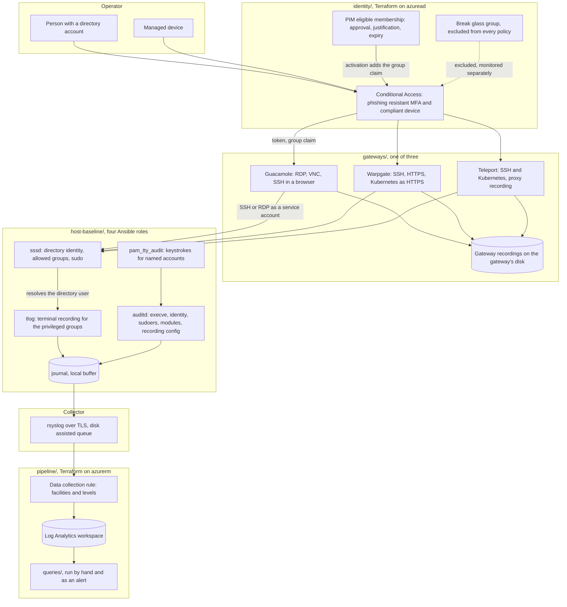

# How a privileged session happens, and what records it

Four layers, and the design only works because they are independent. The
directory decides whether a session may start. The gateway brokers it and records
it. The host runs it and records it again. The pipeline holds the second copy
somewhere neither the gateway nor the host can reach.

## Why two recorders

The gateway recording and the host recording answer the same question and fail in
different ways, which is the whole reason both exist.

| | Gateway recording | Host recording |
| --- | --- | --- |
| Written by | The gateway process | The host, `tlog` and `auditd` |
| Survives root on the host | Yes | Only what has already been forwarded |
| Survives root on the gateway | No | Yes |
| Covers a session that bypassed the gateway | No | Yes |
| Covers `scp`, `sftp`, a port forward | No, not as content | The command, through `auditd` |
| Covers a graphical session | Yes | No |

The row that matters is the third one. A recording that lives only on the gateway
is not evidence against a gateway administrator, and a recording that lives only
on the host is not evidence against somebody with root on the host. Neither is
sufficient alone, and the queries in `pipeline/queries/` exist to compare them.

## The identity join

Everything in this design depends on one string matching in three places:

1. The username claim the gateway takes from the directory token, set by
   `OIDC_USERNAME_CLAIM` in `gateways/guacamole/.env.example`. It ends up in the
   recording filename and the session history row.
2. The username `sssd` resolves on the host, controlled by
   `sssd_use_fully_qualified_names`. It ends up in the `tlog` session metadata.
3. The login uid `auditd` records as `auid`, which resolves to the same account.

If the first two disagree, both halves of the audit trail exist and cannot be
joined, and the symptom is a query in `pipeline/queries/` that returns nothing on
a working deployment. `roles/sssd/README.md` and
`pipeline/queries/activation-then-session.kql` both say so, because it is the
mistake that is hardest to see and cheapest to prevent.

## Where each control actually sits

| Question | Answered by | Not answered by |
| --- | --- | --- |
| May this person authenticate at all | Conditional Access, `identity/`, and only when `policy_state` is `enabled`. The shipped value is `enabledForReportingButNotEnforced`, which enforces nothing | The gateway |
| May they have privilege right now | PIM activation, `identity/` | The gateway, in any free build |
| May they reach this host | The directory group, via `sssd_allowed_groups` | The gateway's own permissions alone |
| May they elevate on this host | The sudoers drop-in, from `sssd_sudo_groups` | The gateway |
| What did they see | The gateway recording, and `tlog` | `auditd` |
| What did they run | `auditd`, key `execve` | The gateway recording, without watching it |
| What did they type | `pam_tty_audit`, for named accounts | Anything else |
| Did anyone turn the recording off | `auditd`, key `recording-config` | The gateway |

## What is deliberately not in the path

- **No agent on the target for the gateway to work.** Guacamole and Warpgate
  reach an ordinary SSH daemon. Teleport is configured with proxy recording for
  the same reason. A design that needs an agent on every target is a design that
  silently excludes the hosts nobody got round to.
- **No password vault.** Gateway to target authentication is a key held by the
  gateway. Adding credential injection would add a second secret store to the
  trust boundary for a problem the key already solves.
- **No network layer control.** Nothing here replaces a firewall or a private
  network. If a host is reachable on port 22 from anywhere, the gateway is a
  convention and `pipeline/queries/session-without-gateway.kql` is how you find
  out people are ignoring it.
